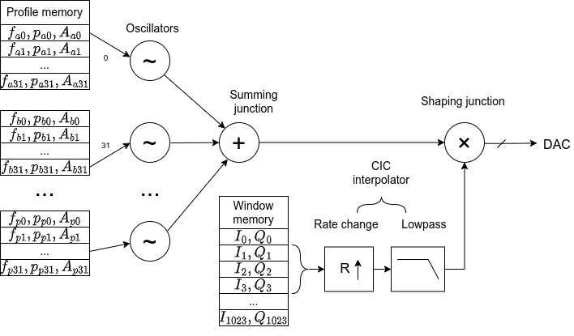
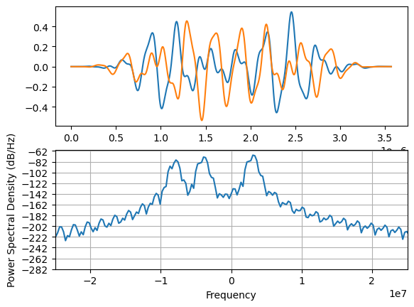
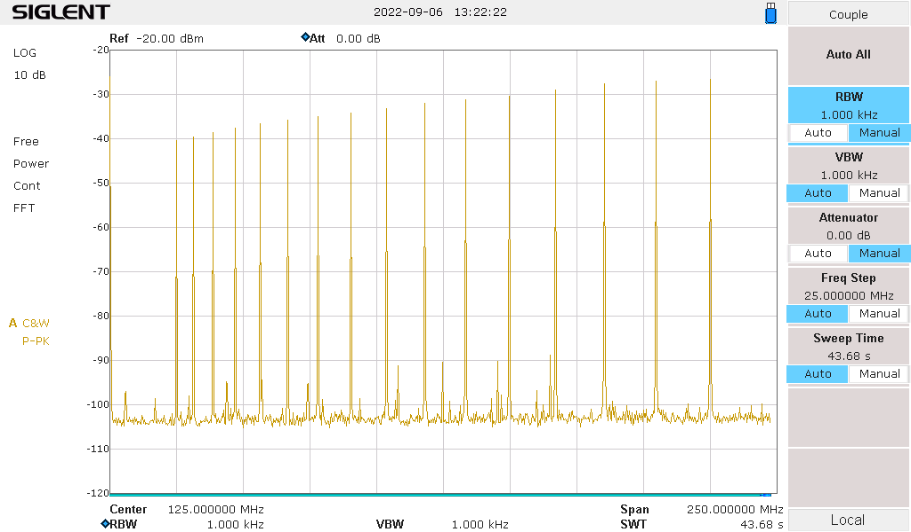
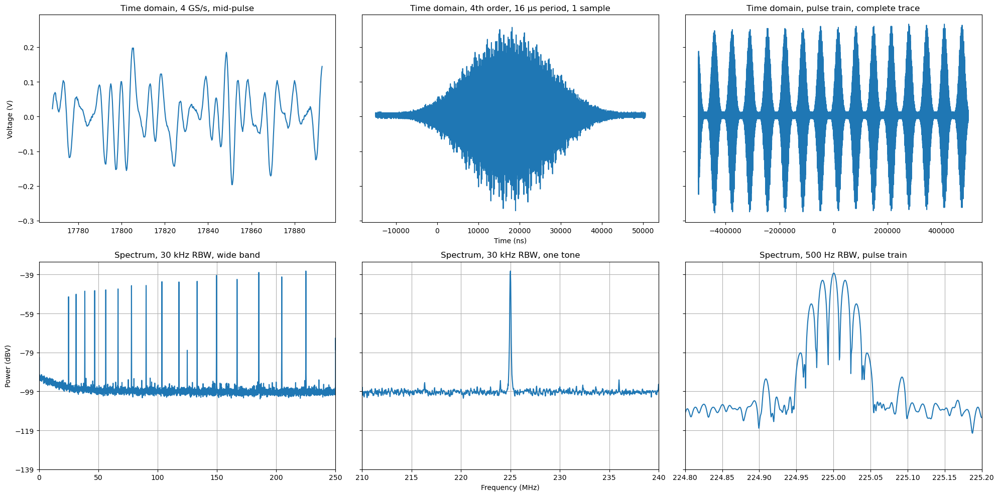

# MIQRO simulator

This is a small simulator for the MIQRO Phaser gateware and its ARTIQ interface. It's intended for experimentation and quick evaluation of the capabilities and the API. The output from the simulation can directly be used as input when integrating the differential equation of one or multiple qubits.

This work is sponsored in part by the Federal Ministry of Education and Research (BMBF) under contract 13N15524.

## Resources

The ARTIQ MIQRO coredevice driver documentation in the [ARTIQ Manual](https://m-labs.hk/artiq/manual-beta/core_drivers_reference.html#artiq.coredevice.phaser.Miqro) and here [miqro.py](miqro.py) describes the functionality and the signal flow.

## Architecture

## Simulator output

## Actual gateware output

## Simulator accuracy/features

The API and features described and implemented here may be slightly different from the actual gateware/ARTIQ implementation. Check back before relying on it.

Differences are:

* Integer quantization of samples not implemented
* NCO/DDS spurs, phase truncation not modelled
* IQ data overflow not implemented
* Overall latency not implemented
* Rounding not implemented
* Window head/tail features not implemented
* Lots of ARTIQ features (DMA, other devices, device db, datasets, ...)
